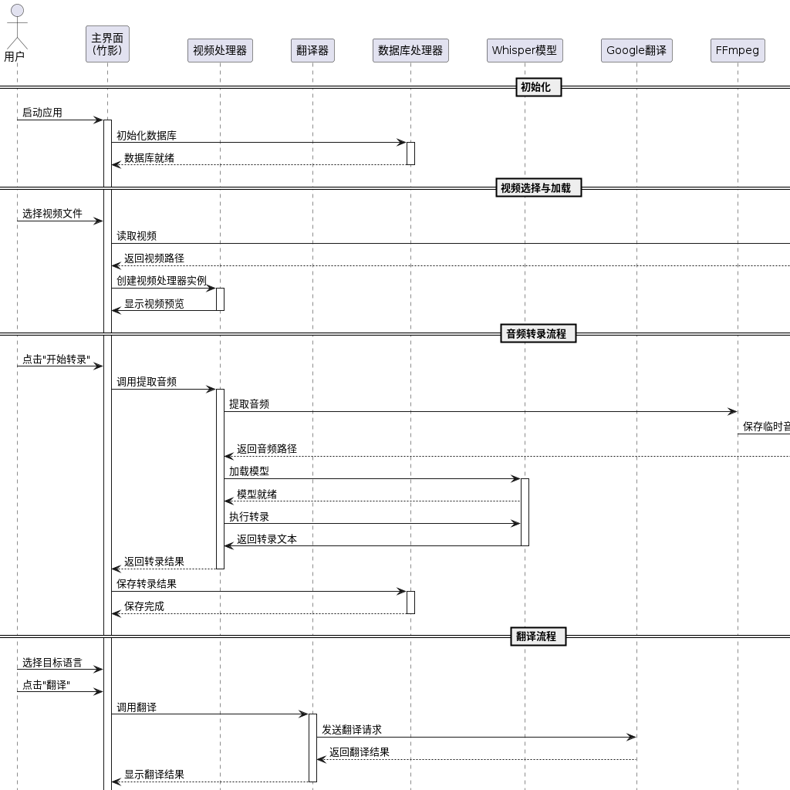

# 竹影视频清音集 🎥

## 简介
竹影是一款创新的视频语音转录与翻译工具，专注于提供高质量的视频音频转文字服务和多语言翻译功能。本项目采用先进的人工智能技术，为用户提供便捷的视频内容处理解决方案。

一名充满热情的开发者，我致力于为开源社区贡献力量。如果您觉得这个项目对您有帮助，请考虑通过以下方式支持我的工作：

- 💼 **招聘机会**：我正在寻找全职开发岗位，擅长 Python、人工智能和音视频处理
- 🎁 **项目赞助**：
  - 赞助方式请见文档底部, 感谢您的支持！
- 📧 **联系方式**：johnmelodymel@qq.com

您的支持将帮助我持续改进这个项目，让它变得更好！

## 技术栈

| 类别 | 描述 |
|------|------|
| 开发语言 | Python 3.8+ |
| 音频处理 | FFmpeg |
| 语音识别 | OpenAI Whisper |
| 机器翻译 | Google Translate |
| GUI框架 | Tkinter |
| 数据存储 | SQLite3 |

## 项目结构
```

竹影/
├── assets/                 # 资源文件
├── src/                    # 源代码
│ ├── translator/           # 翻译模块
│ ├── video_processing/     # 视频处理
│ └── database/             # 数据库操作
├── output/                 # 输出目录
└── log/                    # 日志文件

````

## 使用说明

### 环境配置
```bash
# 安装依赖
pip3 install -r requirements.txt

# 运行程序
python3 main.py
````

### 基本操作流程

1. 选择需要处理的视频文件
2. 点击"开始转录"进行音频提取和转写
3. 选择目标语言进行翻译
4. 导出成品视频

## 核心功能与工作流程

### 主要特性

- 视频音频提取
- 智能语音识别
- 多语言翻译支持
- 音视频同步合成
- 批量处理能力

### 技术实现


### 演示

<div align="center">
    <a href="https://www.bilibili.com/video/BV1hqAjeYEJG">
        
    </a>
</div>

📺 [在 Bilibili 观看完整视频](https://www.bilibili.com/video/BV1hqAjeYEJG)


## 技术细节

### 语音识别算法

采用 Whisper 大规模预训练模型，运用多头注意力机制和转换器架构，实现了：

$P(y|x) = \prod_{t=1}^{T} P(y_t|y_{<t}, x)$

其中：

- $x$ 为输入音频特征
- $y$ 为输出文本序列
- $T$ 为序列长度

### 系统要求

| 项目     | 最低配置                  | 推荐配置               |
| -------- | ------------------------- | ---------------------- |
| 操作系统 | macOS 10.15+ / Windows 10 | macOS 12+ / Windows 11 |
| CPU      | Intel i5 双核             | Intel i7 四核          |
| 内存     | 8GB                       | 16GB                   |
| 显卡     | 集成显卡                  | NVIDIA GTX 1660 或更高 |
| 存储空间 | 10GB                      | 20GB                   |
| 网络     | 基础宽带                  | 高速宽带               |

### 准确度评估

| 评估项目 | 准确率/评分 |
|---------|------------|
| 中文语音识别 | 95%+ |
| 英语语音识别 | 97%+ |
| 德语语音识别 | 93%+ |
| 翻译质量 (BLEU-4) | > 0.75 |

## 许可证

本项目采用 **木兰宽松许可证 (Mulan PSL)** 进行许可。  
有关详细信息，请参阅 [LICENSE](LICENSE) 文件。

[](http://license.coscl.org.cn/MulanPSL2)

## 🌟 开源项目赞助计划

### 用捐赠助力发展

感谢您使用本项目！您的支持是开源持续发展的核心动力。  
每一份捐赠都将直接用于：  
✅ 服务器与基础设施维护  
✅ 新功能开发与版本迭代  
✅ 文档优化与社区建设

点滴支持皆能汇聚成海，让我们共同打造更强大的开源工具！

---

### 🌐 全球捐赠通道

#### 国内用户

<div align="center" style="margin: 40px 0">

<div align="center">
<table>
<tr>
<td align="center" width="300">

<br />
<strong>🔵 支付宝</strong>
</td>
<td align="center" width="300">

<br />
<strong>🟢 微信支付</strong>
</td>
</tr>
</table>
</div>
</div>

#### 国际用户

<div align="center" style="margin: 40px 0">
  <a href="https://qr.alipay.com/fkx19369scgxdrkv8mxso92" target="_blank">
    
  </a>
  
  <a href="https://ko-fi.com/F1F5VCZJU" target="_blank">
    
  </a>
  
  <a href="https://www.paypal.com/paypalme/ctkqiang" target="_blank">
    
  </a>
  
  <a href="https://donate.stripe.com/00gg2nefu6TK1LqeUY" target="_blank">
    
  </a>
</div>

---

### 📌 开发者社交图谱

#### 技术交流

<div align="center" style="margin: 20px 0">
  <a href="https://github.com/ctkqiang" target="_blank">
    
  </a>
  
  <a href="https://stackoverflow.com/users/10758321/%e9%92%9f%e6%99%ba%e5%bc%ba" target="_blank">
    
  </a>
  
  <a href="https://www.linkedin.com/in/ctkqiang/" target="_blank">
    
  </a>
</div>

#### 社交互动

<div align="center" style="margin: 20px 0">
  <a href="https://www.instagram.com/ctkqiang" target="_blank">
    
  </a>
  
  <a href="https://twitch.tv/ctkqiang" target="_blank">
    
  </a>
  
  <a href="https://github.com/ctkqiang/ctkqiang/blob/main/assets/IMG_9245.JPG?raw=true" target="_blank">
    
  </a>
</div>

---

🙌 感谢您成为开源社区的重要一员！  
💬 捐赠后欢迎通过社交平台与我联系，您的名字将出现在项目致谢列表！
